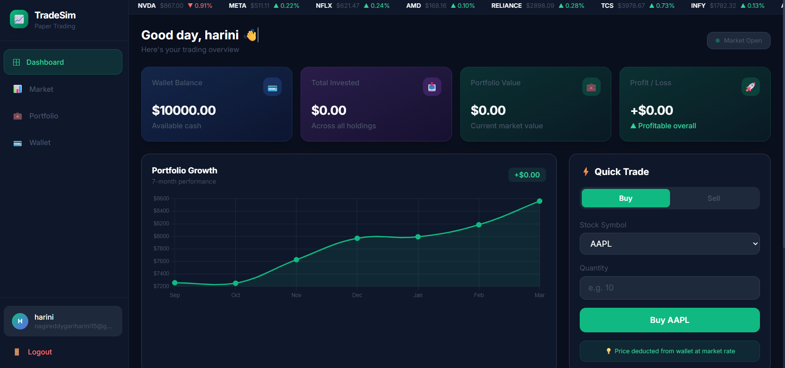
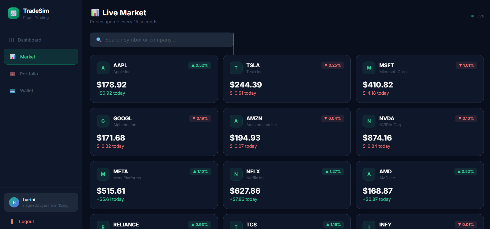
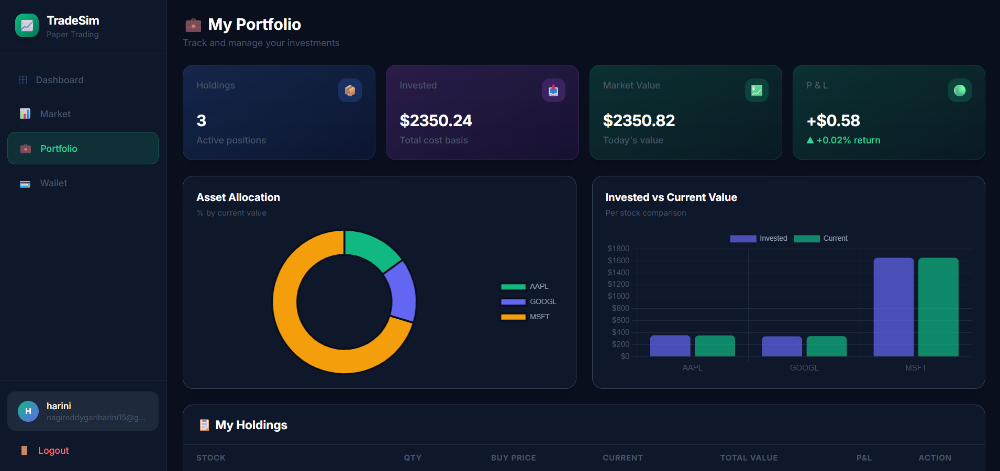
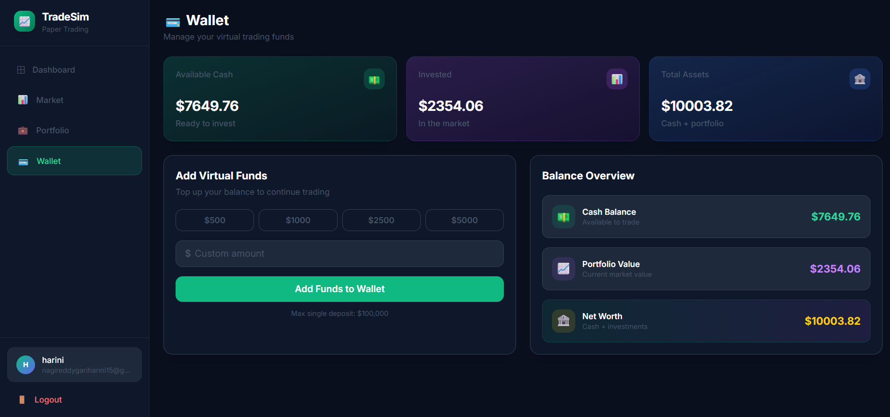
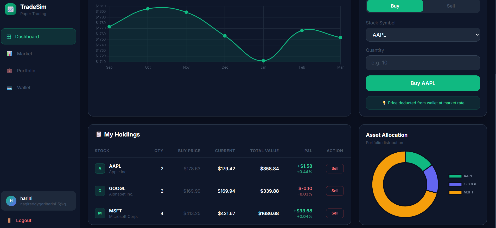

# 📈 TradeSim - Stock Trading Simulator

A full-stack **MERN Stack** stock trading simulator that enables users to practice paper trading with virtual funds. Users can securely register, log in, buy and sell stocks, manage their portfolio, monitor simulated live market prices, and analyze investment performance through an interactive dashboard.

---

## 🚀 Live Demo

🌐 **Frontend:** [TradeSim Live Demo](stock-trade-simulator-murex.vercel.app)

⚙️ **Backend API:** [TradeSim Backend API]https://stock-trade-simulator-backend.onrender.com

---

## 📸 Application Screenshots

### Login Page


---

### Dashboard


---

### Live Market


---

### Portfolio Analytics


---

### Wallet


---

### Holdings


---

# ✨ Features

- 🔐 JWT Authentication
- 👤 Secure User Registration & Login
- 💰 Virtual Trading Wallet ($10,000 Initial Balance)
- 📈 Buy Stocks
- 📉 Sell Stocks
- 📊 Live Simulated Market Prices
- 💼 Portfolio Management
- 📋 Holdings Table
- 📉 Profit & Loss Tracking
- 📊 Investment Analytics
- 📱 Responsive User Interface
- ☁️ MongoDB Atlas Database Integration
- 🌐 Cloud Deployment using Render & Vercel

---

# 🛠 Tech Stack

## Frontend

- React.js
- Vite
- Tailwind CSS
- React Router DOM
- Axios
- React Hot Toast

## Backend

- Node.js
- Express.js
- MongoDB Atlas
- Mongoose
- JWT Authentication
- bcrypt.js

## Deployment

- Vercel
- Render

---

# 📂 Project Structure

```text
TradeSim
│
├── backend
│   ├── config
│   ├── controllers
│   ├── middleware
│   ├── models
│   ├── routes
│   ├── server.js
│   └── package.json
│
├── frontend
│   ├── public
│   ├── src
│   ├── package.json
│   └── vite.config.js
│
├── screenshots
├── README.md
└── .gitignore
```

---

# ⚙️ Installation

## Clone Repository

```bash
git clone https://github.com/Harini-Nagireddy/Stock_Trade_Simulator.git
```

## Backend Setup

```bash
cd backend
npm install
npm run dev
```

## Frontend Setup

```bash
cd frontend
npm install
npm run dev
```

---

# 🔐 Environment Variables

### Backend (`backend/.env`)

```env
MONGO_URI=YOUR_MONGODB_CONNECTION_STRING
JWT_SECRET=YOUR_SECRET_KEY
PORT=5000
```

### Frontend (`frontend/.env`)

```env
VITE_API_URL=https://YOUR-RENDER-BACKEND.onrender.com
```

---

# 📊 Application Modules

- Authentication
- Dashboard
- Live Market
- Portfolio
- Wallet
- Buy Stocks
- Sell Stocks
- Investment Analytics

---

# 🚀 Future Enhancements

- 📡 Real-Time Stock API Integration
- ⭐ Watchlist Feature
- 📜 Transaction History
- 📥 Portfolio Export (PDF/Excel)
- 📧 Email Notifications
- 🌙 Dark / Light Theme
- 📈 Advanced Stock Charts
- 🤖 AI Investment Insights
- 👨‍💼 Admin Dashboard

---

# 👩‍💻 Author

**Harini Nagireddy**

🎓 B.Tech – Computer Science (Data Science)

**GitHub:** https://github.com/Harini-Nagireddy

**LinkedIn:** https://www.linkedin.com/in/harini-nagireddy-95aa65356

---

## ⭐ Support

If you found this project useful, please consider giving it a ⭐ on GitHub.
